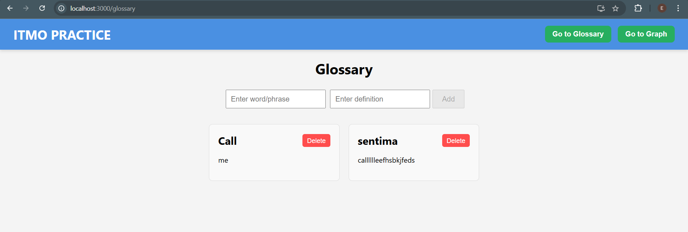

# Full Stack Glossary Application (FastAPI + React)

## Описание

Данное приложение представляет собой глоссарий с API, разработанным на FastAPI, и пользовательским интерфейсом, созданным на React. Развертывание осуществляется с использованием Docker и Docker Compose.

---

## Функциональность приложения

- **Backend (FastAPI):**
  - Получение списка всех терминов.
  - Получение информации о конкретном термине.
  - Добавление нового термина.
  - Обновление существующего термина.
  - Удаление термина.

- **Frontend (React):**
  - Интерфейс для работы с глоссарием.

---

## Требования

Перед началом убедитесь, что на вашем компьютере установлены следующие инструменты:

- [Docker](https://www.docker.com/)
- [Docker Compose](https://docs.docker.com/compose/)

---

## Шаги для развертывания

1. **Клонируйте репозиторий:**

   ```bash
   git clone https://github.com/TimeToStop/task-11
   cd task-11

2. **Постройте и запустите контейнеры:**
  Выполните следующую команду в корневой директории проекта:

  ```bash
  docker-compose up --build

Это команда:

Собирает контейнеры для backend и frontend.
Запускает приложение.

3. **Откройте приложение в браузере:**

Frontend (React): http://localhost:3000
Backend (FastAPI): http://localhost:8000/docs (документация OpenAPI).


## Application Screenshot

Below is a screenshot of the application in action:

